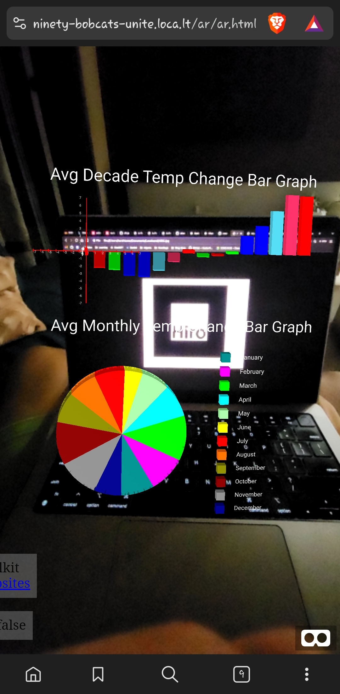

# cosc4426-a3

This repo is for the AR assignment of course COSC4426. 

This project uses the A-Frame to show `Global Temparatures Data` and visualizes it for the user. Its a Node App which serves an HTML file which has aframe enabled. You can access the server on this URL:-

`https://cosc4426-a3.vercel.app/ar/ar.html`

Open above website in your cellphone and give access to your camera.

Now point your mobile camera to the below HIRO code. It should show you two graphs.

The first (bar) graph is about the average temperature of the decade.

The second (pie) graph is to compare/show which month is the hottest and coldest through out the timeframe of 1880 to 2023.


### Screenshots



### How to get started?

Make sure you have NodeJS installed. 

Open up the project and run below mentioned command in your terminal to install the dependencies.

```sh
npm install
```

Once the dependencies are installed, you can run the node server by running the below mentioned command.

```sh
npm run dev
```

This should start up your web app on `http://localhost:9001`. 

Opening the app on `/` should redirect you to the `ar` page where aframe is enabled.

## ⚠️ Caution

Please dont push directly to the repo as it would auto-deploy changes. Rather, please submit a PR and someone from the team will review and merge your PR.
